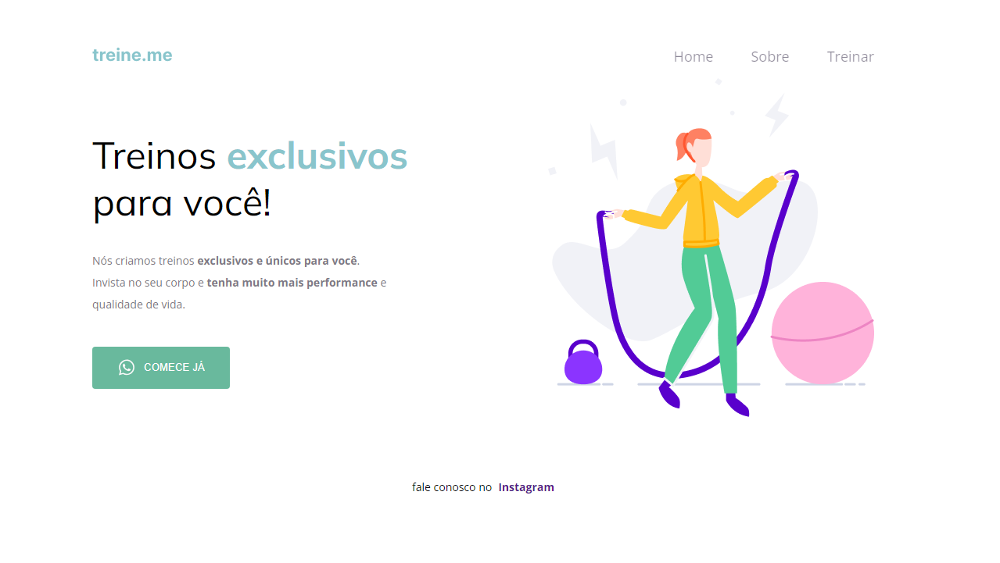

<h1 align="center"> Landing Page - Refatorando 01 </h1>

  <a href="#-tecnologias">Tecnologias</a>&nbsp;&nbsp;&nbsp;|&nbsp;&nbsp;&nbsp;
  <a href="#-projeto">Projeto</a>&nbsp;&nbsp;&nbsp;|&nbsp;&nbsp;&nbsp;
  <a href="#-layout">Layout</a>&nbsp;&nbsp;&nbsp;

 

## 🚀 Tecnologias

Esse projeto foi desenvolvido com as seguintes tecnologias:

- HTML e CSS
- Figma

## 💻 Projeto

O intuito desse código foi a refatoração de um código proposto pela RocketSeat. Nesse projeto estão as pastas do código com a semântica errada e com a refatoração.

Projeto:

  

## 🔖 Layout

Você pode visualizar o layout do projeto através [DESSE LINK](https://www.figma.com/file/Vg3ISQxLN0jEOW3ud4tsSY/Explorer-Projeto-02-Copy?fuid=1256335722836990720).
